## Overview

Visor KPI Comercial is a **sales intelligence dashboard** built with a clear separation of concerns between business logic, data processing, and presentation layers. The system transforms Excel-based sales data into actionable business intelligence through automated ETL pipelines, KPI calculation engines, and interactive visualizations.

## Architecture Principles

The system follows these core architectural principles:

- **Layer Separation**: Business logic (`src/`) is completely decoupled from UI (`components/`, `pages/`)
- **Testability**: Core logic is framework-agnostic and fully testable
- **Cacheability**: Data loading and transformations are cached for performance
- **Modularity**: Each module has a single, well-defined responsibility
- **Scalability**: Pipeline designed to handle 30,000+ transaction records efficiently

## System Layers

<CardGroup cols={3}>
  <Card title="Data Layer" icon="database" color="#2E5FA3">
    ETL pipeline, data validation, and Excel ingestion
  </Card>
  <Card title="Business Logic Layer" icon="calculator" color="#00C49F">
    KPI engines, Pareto analysis, alerts, and reporting
  </Card>
  <Card title="Presentation Layer" icon="chart-line" color="#FFB347">
    Multi-page Streamlit app with reusable UI components
  </Card>
</CardGroup>

## Project Structure

```
visor_kpi/
├── app.py                     # Main entry point - Executive Summary page
├── config.py                  # Global configuration (colors, thresholds, formatting)
├── requirements.txt           # Python dependencies
│
├── pages/                     # Multi-page application views
│   ├── 1_gerencia.py          # Management consolidated view
│   ├── 2_vendedores.py        # Individual salesperson view
│   ├── 3_clientes.py          # Customer portfolio analysis
│   ├── 4_productos.py         # Product ranking and analysis
│   └── 5_alertas.py           # Alerts and opportunities center
│
├── src/                       # Business logic core (framework-agnostic)
│   ├── data_loader.py         # ETL: reading, validation, filtering
│   ├── kpi_engine.py          # KPI calculation engine
│   ├── pareto.py              # 80/20 analysis and A/B/C classification
│   ├── alerts_engine.py       # Alert rules engine (ALT001-ALT007)
│   └── reports.py             # Exportable report generation
│
├── components/                # Reusable UI components
│   ├── kpi_card.py            # KPI cards with traffic light indicators
│   ├── charts.py              # Plotly visualizations
│   ├── filters.py             # Sidebar filters with session_state
│   └── rankings.py            # Styled ranking tables
│
├── assets/
│   └── style.css              # Global dark theme styling
│
├── data/
│   ├── mock/
│   │   └── generate_mock_data.py   # Demo data generator (Faker es_AR)
│   └── raw/
│       └── mock_data.xlsx          # Generated Excel file (local)
│
└── tests/                     # Automated test suite
    ├── test_mock_data.py      # Dataset validation
    ├── test_kpis.py           # KPI engine tests
    └── test_alerts.py         # Alert engine tests
```

## Layer Details

### 1. Data Layer (`src/data_loader.py`)

**Responsibilities:**
- Read and parse multi-sheet Excel files
- Data type conversion and validation
- Date handling and period calculations
- Master DataFrame creation with all joins
- Caching with `@st.cache_data` (TTL: 1 hour)

**Key Functions:**
- `load_data()` → Reads Excel sheets into dict of DataFrames
- `get_master_df()` → Creates denormalized master DataFrame with all joins
- `get_filtered_data()` → Applies date, salesperson, zone, and channel filters
- `get_filtered_data_periodo_anterior()` → Retrieves equivalent previous period

**Performance:**
- Initial load: < 3 seconds for 30,000 records
- Subsequent loads: cached in memory
- Automatic null detection and outlier handling

### 2. Business Logic Layer (`src/`)

#### KPI Engine (`kpi_engine.py`)

Calculates all business metrics:

| Function | Output | Purpose |
|----------|--------|----------|
| `kpi_ventas_periodo()` | dict | Sales, target achievement, vs previous period |
| `kpi_margen()` | dict | Gross margin, margin %, delta |
| `kpi_cobertura_clientes()` | dict | Customer coverage, lost, recovered, new |
| `kpi_por_vendedor()` | DataFrame | Per-salesperson KPIs with rankings |
| `kpi_productos()` | DataFrame | Product KPIs with Pareto classification |
| `kpi_clientes()` | DataFrame | Customer KPIs with risk flags |
| `kpi_evolucion_mensual()` | DataFrame | Monthly evolution for time series |

**Traffic Light Logic:**
- 🟢 Green: ≥100% target achievement
- 🟡 Orange: 80-99% target achievement
- 🔴 Red: &lt;80% target achievement

#### Pareto Analysis (`pareto.py`)

Implements 80/20 analysis:

- **Category A**: Entities contributing 0-80% of cumulative value
- **Category B**: Entities contributing 80-95% of cumulative value
- **Category C**: Entities contributing 95-100% of cumulative value

**Gini Index**: Concentration coefficient (0 = perfect equality, 1 = total concentration)

#### Alerts Engine (`alerts_engine.py`)

7 pre-configured business rules:

<Tabs>
  <Tab title="Critical Alerts">
    - **ALT001**: Salesperson with &lt;65% target achievement (last 30 days)
    - **ALT005**: Margin below minimum threshold
  </Tab>
  <Tab title="High Priority">
    - **ALT002**: Active customer without purchases (45 days)
    - **ALT003**: Category A customer with >25% sales drop
    - **ALT006**: Coverage &lt;60%
  </Tab>
  <Tab title="Opportunities">
    - **ALT006**: Category B customer with >30% growth (upgrade potential)
    - **ALT007**: Team at 85%+ of target with 5+ business days remaining
  </Tab>
  <Tab title="Informational">
    - **ALT004**: Active product without sales (60 days)
    - **ALT005**: Salesperson without activity (7 business days)
  </Tab>
</Tabs>

### 3. Presentation Layer

#### Multi-Page Application

Streamlit's native multi-page architecture with numbered prefixes for ordering:

```python
pages/
├── 1_gerencia.py       # Management view
├── 2_vendedores.py     # Salesperson view
├── 3_clientes.py       # Customer analysis
├── 4_productos.py      # Product analysis
└── 5_alertas.py        # Alert center
```

#### Reusable Components

**`components/kpi_card.py`**
- Displays KPI value with optional delta and target
- Traffic light color based on performance
- Icon support

**`components/charts.py`**
- `chart_evolucion_ventas()`: Time series with target line
- `chart_gauge_cumplimiento()`: Performance gauge (0-150%)
- `chart_barras_vendedores()`: Comparative bar charts
- `chart_donut_canales()`: Channel distribution donut
- `chart_treemap_productos()`: Product portfolio treemap
- `chart_scatter_clientes()`: Customer frequency vs amount

**`components/rankings.py`**
- Styled HTML tables with traffic lights
- Ranking position with delta vs previous period
- Responsive design

**`components/filters.py`**
- Sidebar date range selector
- Multi-select for salespersons, zones, channels
- Session state management

## Data Flow

```mermaid
graph LR
    A[Excel File] -->|load_data| B[Raw DataFrames]
    B -->|get_master_df| C[Master DataFrame]
    C -->|get_filtered_data| D[Filtered Data]
    D -->|kpi_engine| E[KPIs]
    D -->|alerts_engine| F[Alerts]
    E -->|components| G[UI]
    F -->|components| G
    style A fill:#1A2535
    style B fill:#1A2535
    style C fill:#1A2535
    style D fill:#2E5FA3
    style E fill:#00C49F
    style F fill:#E84855
    style G fill:#FFB347
```



**Flow Description:**

1. **Ingestion**: Excel file read into 5 DataFrames (ventas, vendedores, clientes, productos, objetivos)
2. **Transformation**: Master DataFrame created with LEFT JOINs on all dimensions
3. **Filtering**: User-selected date ranges, salespersons, zones, channels applied
4. **Calculation**: KPI and alert engines process filtered data
5. **Rendering**: Components receive calculated data and render UI

## Configuration Management

**`config.py`** centralizes all system configuration:

<AccordionGroup>
  <Accordion title="Colors & Theme">
    - Primary palette: `#1B3A6B`, `#2E5FA3`, `#00C49F`
    - Traffic light: `#00C49F` (success), `#FFB347` (warning), `#E84855` (danger)
    - Dark mode background: `#0F1923`, cards: `#1A2535`
  </Accordion>
  <Accordion title="Business Thresholds">
    - `cumplimiento_ok`: 1.00 (100% = green)
    - `cumplimiento_warning`: 0.80 (80% = orange)
    - `caida_critica`: -0.20 (-20% = alert)
    - `pareto_acumulado`: 0.80 (80% cumulative = category A)
  </Accordion>
  <Accordion title="Formatting Functions">
    - `fmt_moneda()`: Argentine currency format ($1.284.500)
    - `fmt_pct()`: Percentage with decimals (84.2%)
    - `fmt_delta()`: Delta with arrows (▲ +8.2% / ▼ -3.1%)
    - `fmt_numero()`: Thousands separator (1.284)
  </Accordion>
</AccordionGroup>

## Session State Management

Streamlit session state stores:
- Selected filters (dates, salespersons, zones, channels)
- Period shortcuts ("This month", "Last quarter", "This year")
- UI state for expandable sections

## Caching Strategy

| Function | Cache | TTL | Why |
|----------|-------|-----|-----|
| `load_data()` | `@st.cache_data` | 3600s | Raw data rarely changes |
| `get_master_df()` | `@st.cache_data` | 3600s | Expensive joins |
| Charts | None | N/A | Dynamic based on filters |

<Note>
  Cache is invalidated when:
  - TTL expires (1 hour)
  - Streamlit app is reloaded
  - Source Excel file is modified
</Note>

## Deployment Architecture

The application supports multiple deployment models:

<Tabs>
  <Tab title="Local Development">
    ```bash
    streamlit run app.py
    ```
    Runs on `localhost:8501`
  </Tab>
  <Tab title="Streamlit Cloud">
    - Deployed at: `https://excel-to-kpi-dashboard.streamlit.app/`
    - Auto-deploys from GitHub main branch
    - Free tier with resource limits
  </Tab>
  <Tab title="Docker (Future)">
    - Containerized deployment
    - Environment variable configuration
    - Scalable with load balancer
  </Tab>
</Tabs>

## Performance Characteristics

| Metric | Value |
|--------|-------|
| Dashboard load time | < 3 seconds (full dataset) |
| Dataset size | 30,000 transactions, 27 months |
| Entities monitored | 12 salespersons, 180 customers, 60 SKUs |
| Active alert rules | 7 |
| Test coverage | 51 passing tests |
| Memory footprint | ~150 MB (cached data) |

## Security Considerations

<Warning>
  Current implementation uses **demo data** with no authentication. For production:
  - Implement user authentication (Streamlit Auth, OAuth)
  - Add role-based access control (RBAC)
  - Encrypt sensitive data in transit and at rest
  - Implement audit logging
  - Validate and sanitize all user inputs
</Warning>

## Extensibility Points

The architecture supports extension through:

1. **New KPIs**: Add functions to `kpi_engine.py`
2. **New Alerts**: Add rules to `ALERT_RULES` in `alerts_engine.py`
3. **New Pages**: Add `N_pagename.py` to `pages/` directory
4. **New Charts**: Add functions to `components/charts.py`
5. **New Data Sources**: Extend `data_loader.py` (currently Excel-only)

## Next Steps

<CardGroup cols={2}>
  <Card title="Data Pipeline" href="/technical/data-pipeline" icon="diagram-project">
    Deep dive into ETL processes and data transformations
  </Card>
  <Card title="Tech Stack" href="/technical/tech-stack" icon="layer-group">
    Complete list of technologies and dependencies
  </Card>
</CardGroup>