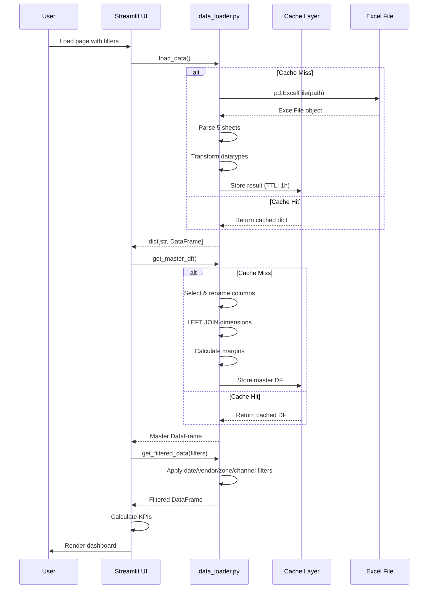

## Overview

The data pipeline transforms raw Excel sales data into a denormalized, analytics-ready master DataFrame. The pipeline is implemented in `src/data_loader.py` and uses **pandas** for data manipulation and **openpyxl** for Excel reading.

## Pipeline Architecture

```mermaid
graph TD
    A[Excel File<br/>mock_data.xlsx] -->|read| B[ExcelFile Object]
    B -->|parse sheets| C[5 Raw DataFrames]
    C -->|validate & transform| D[Cleaned DataFrames]
    D -->|join dimensions| E[Master DataFrame]
    E -->|apply filters| F[Filtered Data]
    F -->|KPI calculations| G[Business Metrics]
    
    style A fill:#1A2535
    style C fill:#2E5FA3
    style D fill:#00C49F
    style E fill:#FFB347
    style G fill:#E84855
```



## Data Sources

### Input: Excel Workbook

**File**: `data/raw/mock_data.xlsx`

**Structure**: Multi-sheet workbook with 5 normalized tables

<Tabs>
  <Tab title="Ventas (Sales)">
    **~30,000 rows** - Transactional fact table
    
    | Column | Type | Description |
    |--------|------|-------------|
    | `id_venta` | str | Unique transaction ID |
    | `fecha` | datetime | Sale date |
    | `id_vendedor` | str | Salesperson foreign key |
    | `id_cliente` | str | Customer foreign key |
    | `id_producto` | str | Product foreign key |
    | `cantidad` | float | Units sold |
    | `precio_unitario` | float | Unit price |
    | `importe_bruto` | float | Gross amount |
    | `descuento_pct` | float | Discount % |
    | `importe_neto` | float | Net amount (after discount) |
  </Tab>
  
  <Tab title="Vendedores (Salespersons)">
    **12 rows** - Salesperson dimension
    
    | Column | Type | Description |
    |--------|------|-------------|
    | `id_vendedor` | str | Primary key |
    | `nombre_completo` | str | Full name |
    | `zona` | str | Sales zone (GBA Norte/Sur, Interior) |
    | `perfil` | str | Profile (estrella/estable/desarrollo/problemático) |
    | `objetivo_mensual_base` | float | Base monthly target |
    | `antiguedad_años` | int | Years of experience |
    | `activo` | bool | Active status |
  </Tab>
  
  <Tab title="Clientes (Customers)">
    **180 rows** - Customer dimension
    
    | Column | Type | Description |
    |--------|------|-------------|
    | `id_cliente` | str | Primary key |
    | `razon_social` | str | Business name |
    | `canal` | str | Channel (Tradicional/Supermercadismo/Mayorista/HoReCa) |
    | `zona` | str | Geographic zone |
    | `id_vendedor_asignado` | str | Assigned salesperson |
    | `fecha_alta` | datetime | Registration date |
    | `activo` | bool | Active status |
    | `objetivo_mensual_cliente` | float | Customer target |
  </Tab>
  
  <Tab title="Productos (Products)">
    **60 rows** - Product dimension
    
    | Column | Type | Description |
    |--------|------|-------------|
    | `id_producto` | str | Primary key (SKU) |
    | `descripcion` | str | Product name |
    | `categoria` | str | Category (5 categories) |
    | `precio_unitario` | float | Catalog unit price |
    | `costo_unitario` | float | Unit cost |
    | `activo` | bool | Active status |
  </Tab>
  
  <Tab title="Objetivos (Targets)">
    **~324 rows** - Monthly targets per salesperson
    
    | Column | Type | Description |
    |--------|------|-------------|
    | `id_vendedor` | str | Salesperson FK |
    | `año` | int | Year |
    | `mes` | int | Month |
    | `periodo` | datetime | Period (YYYY-MM-01) |
    | `objetivo` | float | Target amount |
  </Tab>
</Tabs>

## ETL Stages

### Stage 1: Extraction

**Function**: `load_data()`

```python
@st.cache_data(ttl=3600, show_spinner=False)
def load_data() -> dict[str, pd.DataFrame]:
    """Reads Excel and returns dict with parsed DataFrames."""
```

**Process:**

1. **File Validation**: Check if `DATA_PATH` exists
2. **Excel Reading**: `pd.ExcelFile(DATA_PATH)` creates reader object
3. **Sheet Parsing**: `xl.parse(sheet_name)` for each of 5 sheets
4. **Return**: Dictionary with keys: `ventas`, `vendedores`, `clientes`, `productos`, `objetivos`

**Error Handling:**

<CodeGroup>
```python File Not Found
if not os.path.exists(DATA_PATH):
    raise FileNotFoundError(
        f"No se encontró el archivo de datos: {DATA_PATH}\n"
        "Ejecutá primero: python data/mock/generate_mock_data.py"
    )
```
</CodeGroup>

<Info>
  **Caching**: Data is cached for 1 hour (`ttl=3600`) to avoid re-reading Excel on every page load.
</Info>

### Stage 2: Transformation

#### 2.1 Date Parsing

**Ventas (Sales) Sheet:**

```python
ventas["fecha"] = pd.to_datetime(ventas["fecha"])
ventas["año"]   = ventas["fecha"].dt.year
ventas["mes"]   = ventas["fecha"].dt.month
ventas["periodo"] = ventas["fecha"].dt.to_period("M")
```

- Converts string dates to `datetime64[ns]`
- Extracts year and month for grouping
- Creates period objects for monthly aggregation

**Clientes (Customers) Sheet:**

```python
clientes["fecha_alta"] = pd.to_datetime(clientes["fecha_alta"])
```

**Objetivos (Targets) Sheet:**

```python
if "periodo" in objetivos.columns:
    objetivos["periodo"] = pd.to_datetime(objetivos["periodo"])
else:
    # Fallback: construct from año and mes
    objetivos["periodo"] = pd.to_datetime(
        objetivos[["año", "mes"]].assign(day=1)
    )
```

#### 2.2 Numeric Conversion

All numeric columns are coerced to float with error handling:

```python
for col in ["importe_neto", "importe_bruto", "cantidad", 
            "precio_unitario", "descuento_pct"]:
    if col in ventas.columns:
        ventas[col] = pd.to_numeric(ventas[col], errors="coerce").fillna(0)
```

<Warning>
  `errors="coerce"` converts invalid values to `NaN`, then `fillna(0)` replaces them with zero. This prevents pipeline failures but may mask data quality issues.
</Warning>

#### 2.3 Boolean Conversion

```python
vendedores["activo"] = vendedores["activo"].astype(bool)
clientes["activo"]   = clientes["activo"].astype(bool)
productos["activo"]  = productos["activo"].astype(bool)
```

### Stage 3: Master DataFrame Creation

**Function**: `get_master_df()`

```python
@st.cache_data(ttl=3600, show_spinner=False)
def get_master_df() -> pd.DataFrame:
    """Master DataFrame with all joins applied."""
```

#### 3.1 Dimension Preparation

**Select and rename columns** to avoid conflicts:

<CodeGroup>
```python Vendedores
vendedores = vendedores[["id_vendedor", "nombre_completo", "zona", "perfil"]].copy()
vendedores = vendedores.rename(columns={
    "nombre_completo": "nombre_vendedor",
    "zona": "zona_vendedor",
})
```

```python Clientes
clientes = clientes[["id_cliente", "razon_social", "canal", "zona",
                     "id_vendedor_asignado", "activo"]].copy()
clientes = clientes.rename(columns={
    "zona": "zona_cliente",
    "activo": "cliente_activo",
})
```

```python Productos
productos = productos[["id_producto", "descripcion", "categoria",
                       "precio_unitario", "costo_unitario"]].copy()
productos = productos.rename(columns={
    "precio_unitario": "precio_catalogo",
    "costo_unitario":  "costo_catalogo",
})
```
</CodeGroup>

#### 3.2 Join Operations

**Star schema joins** (LEFT JOIN to preserve all transactions):

```python
df = ventas.merge(vendedores, on="id_vendedor", how="left")
df = df.merge(clientes,       on="id_cliente",  how="left")
df = df.merge(productos,      on="id_producto", how="left")
```

**Result**: Denormalized DataFrame with **all dimensions enriched**:

- Transaction details + salesperson name, zone, profile
- Transaction details + customer name, channel, zone
- Transaction details + product description, category, costs

#### 3.3 Derived Calculations

**Margin Calculation:**

```python
# Margin = Revenue - Cost
df["margen_neto"] = df["importe_neto"] - (
    df["costo_catalogo"] / df["precio_catalogo"] * df["importe_neto"]
)

# Margin %
df["margen_pct"] = (df["margen_neto"] / df["importe_neto"]).clip(0, 1)
```

<Note>
  `.clip(0, 1)` ensures margin percentage stays within [0, 100%] range.
</Note>

### Stage 4: Filtering

**Function**: `get_filtered_data()`

```python
def get_filtered_data(
    fecha_desde: date,
    fecha_hasta: date,
    vendedores: list[str] | None = None,
    zonas: list[str] | None = None,
    canales: list[str] | None = None,
) -> pd.DataFrame:
```

**Filters Applied:**

1. **Date Range** (required):
   ```python
   df = df[
       (df["fecha"].dt.date >= fecha_desde) &
       (df["fecha"].dt.date <= fecha_hasta)
   ]
   ```

2. **Salespersons** (optional):
   ```python
   if vendedores:
       df = df[df["id_vendedor"].isin(vendedores)]
   ```

3. **Zones** (optional):
   ```python
   if zonas:
       df = df[df["zona_vendedor"].isin(zonas)]
   ```

4. **Channels** (optional):
   ```python
   if canales:
       df = df[df["canal"].isin(canales)]
   ```

**Return**: Filtered copy of master DataFrame

### Stage 5: Previous Period Calculation

**Function**: `get_filtered_data_periodo_anterior()`

```python
def get_filtered_data_periodo_anterior(
    fecha_desde: date,
    fecha_hasta: date,
    vendedores: list[str] | None = None,
    zonas: list[str] | None = None,
    canales: list[str] | None = None,
) -> pd.DataFrame:
    """Returns equivalent previous period data."""
    from config import get_periodo_anterior
    nueva_desde, nueva_hasta = get_periodo_anterior(fecha_desde, fecha_hasta)
    return get_filtered_data(nueva_desde, nueva_hasta, vendedores, zonas, canales)
```

**Period Calculation Logic** (from `config.py`):

```python
def get_periodo_anterior(fecha_desde: date, fecha_hasta: date):
    """Calculates equivalent previous period based on duration."""
    duracion = (fecha_hasta - fecha_desde).days + 1
    nueva_hasta = fecha_desde - relativedelta(days=1)
    nueva_desde = nueva_hasta - relativedelta(days=duracion - 1)
    return nueva_desde, nueva_hasta
```

**Example:**
- Current: 2024-03-01 to 2024-03-31 (31 days)
- Previous: 2024-01-31 to 2024-02-29 (31 days back from 2024-02-28)

## Data Quality & Validation

### Null Handling

| Column Type | Strategy |
|-------------|----------|
| Numeric | `fillna(0)` after coercion |
| Dates | Raise error if critical (fecha, periodo) |
| Strings | Leave as NaN (handled downstream) |
| Booleans | Coerce to True/False |

### Outlier Detection

<Note>
  Current implementation does **not** perform automatic outlier removal. This is intentional to preserve data integrity. Outliers are visible in visualizations for manual review.
</Note>

### Data Consistency Checks

The test suite (`tests/test_mock_data.py`) validates:

- **Referential Integrity**: All foreign keys exist in dimension tables
- **Date Ranges**: All dates within expected range (2023-01-01 to 2026-03-31)
- **Numeric Ranges**: Positive amounts, valid percentages (0-1)
- **Record Counts**: Expected number of transactions (~30,000)

## Helper Functions

### Available Metadata Queries

```python
get_lista_vendedores() -> list[dict]
# Returns: [{"id_vendedor": "V001", "nombre_completo": "...", "zona": "..."}]

get_lista_zonas() -> list[str]
# Returns: ["GBA Norte", "GBA Sur", "Interior"]

get_lista_canales() -> list[str]
# Returns: ["Canal Tradicional", "HoReCa", "Mayorista", "Supermercadismo"]

check_data_available() -> bool
# Returns: True if Excel file exists
```

## Performance Optimization

### Caching Strategy

<Tabs>
  <Tab title="@st.cache_data">
    - Applied to `load_data()` and `get_master_df()`
    - TTL: 3600 seconds (1 hour)
    - Invalidation: Automatic on file modification or TTL expiry
    - Memory: ~150 MB for full dataset
  </Tab>
  
  <Tab title="Filtering Performance">
    - Filters applied on cached master DataFrame
    - Boolean indexing: O(n) complexity
    - Typical filter time: &lt;100ms for 30K rows
  </Tab>
  
  <Tab title="Join Performance">
    - Joins performed once during master DF creation
    - Cached result reused for all subsequent queries
    - No re-joining on filter changes
  </Tab>
</Tabs>

### Memory Management

- **Copy Strategy**: `get_filtered_data()` returns `.copy()` to prevent mutations
- **Column Selection**: Dimensions tables select only required columns
- **No Intermediate Storage**: Transformations applied in-place where safe

## Data Flow Diagram (Detailed)



## Error Handling

<AccordionGroup>
  <Accordion title="File Not Found">
    ```python
    if not os.path.exists(DATA_PATH):
        raise FileNotFoundError("...")
    ```
    **UI Behavior**: Red error message with instructions to run data generator
  </Accordion>
  
  <Accordion title="Empty DataFrame">
    ```python
    if df.empty:
        st.warning("No hay datos para los filtros seleccionados")
        st.stop()
    ```
    **UI Behavior**: Orange warning, dashboard stops rendering
  </Accordion>
  
  <Accordion title="Invalid Dates">
    ```python
    pd.to_datetime(ventas["fecha"])
    ```
    **Behavior**: Raises `ValueError` if unparseable, no graceful fallback
  </Accordion>
  
  <Accordion title="Missing Columns">
    ```python
    if col in ventas.columns:
        ventas[col] = pd.to_numeric(...)
    ```
    **Behavior**: Silently skips transformation, may cause downstream errors
  </Accordion>
</AccordionGroup>

## Future Enhancements

<CardGroup cols={2}>
  <Card title="Real-Time Data Sources" icon="database">
    - Connect to SQL databases (PostgreSQL, MySQL)
    - API integration with ERP/CRM systems
    - Incremental loading (only new transactions)
  </Card>
  
  <Card title="Data Validation Layer" icon="shield-check">
    - Schema validation with Pydantic
    - Automated data quality checks
    - Reject/quarantine invalid records
  </Card>
  
  <Card title="Advanced Transformations" icon="wand-magic-sparkles">
    - Currency conversion for multi-currency sales
    - Seasonality adjustment
    - Rolling window calculations
  </Card>
  
  <Card title="Data Lineage" icon="diagram-project">
    - Track data provenance
    - Audit log for transformations
    - Rollback capability
  </Card>
</CardGroup>

## Next Steps

<CardGroup cols={2}>
  <Card title="System Architecture" href="/technical/architecture" icon="sitemap">
    Overview of the complete system architecture
  </Card>
  <Card title="Tech Stack" href="/technical/tech-stack" icon="layer-group">
    Detailed breakdown of all technologies used
  </Card>
</CardGroup>