## Overview

Visor KPI Comercial is built with a **modern Python stack** optimized for data analysis and interactive web applications. The stack prioritizes:

- **Rapid Development**: Streamlit enables fast UI prototyping
- **Data Processing Performance**: pandas and NumPy for efficient computation
- **Rich Visualizations**: Plotly for interactive charts
- **Maintainability**: Clear dependencies with version pinning

## Core Technologies

<CardGroup cols={2}>
  <Card title="Python 3.10+" icon="python" color="#3776AB">
    Primary runtime environment
  </Card>
  <Card title="Streamlit 1.32" icon="stream" color="#FF4B4B">
    Web application framework
  </Card>
  <Card title="Pandas 2.2" icon="table" color="#150458">
    Data manipulation and analysis
  </Card>
  <Card title="Plotly 5.19" icon="chart-line" color="#3F4F75">
    Interactive visualizations
  </Card>
</CardGroup>

## Dependency Breakdown

### requirements.txt

```txt
streamlit>=1.32.0,&lt;2.0
pandas>=2.2.0,&lt;3.0
plotly>=5.19.0,&lt;6.0
openpyxl>=3.1.5
numpy>=1.26.4,&lt;2.0
faker>=23.2.0
pytest>=8.0.0
xlsxwriter>=3.1.9
python-dateutil>=2.9.0
```

<Note>
  **Version Strategy**: Major versions are pinned (`&lt;2.0`, `&lt;3.0`) to prevent breaking changes, while minor versions allow patches and features.
</Note>

---

## Layer-by-Layer Stack

### 1. Web Framework Layer

<Tabs>
  <Tab title="Streamlit">
    **Version**: `1.32.0`
    
    **Purpose**: Core web application framework
    
    **Key Features Used**:
    - Multi-page application architecture
    - Session state management
    - Component system (columns, tabs, expanders)
    - Caching decorators (`@st.cache_data`)
    - Sidebar and filters
    - Plotly integration
    
    **Configuration**:
    ```python
    st.set_page_config(
        page_title="Visor KPI Comercial",
        page_icon="📊",
        layout="wide",
        initial_sidebar_state="expanded",
    )
    ```
    
    **Deployment**: Native support for Streamlit Cloud
  </Tab>
  
  <Tab title="Why Streamlit?">
    **Advantages**:
    - ✅ Pure Python (no HTML/CSS/JS required)
    - ✅ Rapid prototyping (< 300 lines for main app)
    - ✅ Built-in caching and state management
    - ✅ Free hosting on Streamlit Cloud
    - ✅ Excellent for internal dashboards
    
    **Limitations**:
    - ❌ Not suitable for consumer-facing apps
    - ❌ Limited customization vs React/Vue
    - ❌ Single-user session model (no multi-tenancy)
    - ❌ Requires Python backend (no static export)
  </Tab>
</Tabs>

### 2. Data Processing Layer

<Tabs>
  <Tab title="Pandas">
    **Version**: `2.2.0`
    
    **Purpose**: Core data manipulation and analysis
    
    **Key Operations**:
    
    | Operation | Usage |
    |-----------|-------|
    | `pd.read_excel()` | Excel ingestion |
    | `pd.to_datetime()` | Date parsing |
    | `pd.merge()` | JOIN operations |
    | `.groupby()` | Aggregations |
    | `.pivot_table()` | Data reshaping |
    | `.rolling()` | Time series |
    | `.fillna()`, `.clip()` | Data cleaning |
    
    **Performance Considerations**:
    - ~30,000 rows: **Excellent** (< 1s operations)
    - 100,000+ rows: Consider **Polars** or **Dask**
    - Memory usage: ~5x raw CSV size
  </Tab>
  
  <Tab title="NumPy">
    **Version**: `1.26.4`
    
    **Purpose**: Numerical computations and array operations
    
    **Key Usage**:
    ```python
    import numpy as np
    
    # Gini index calculation
    valores = np.sort(valores.astype(float))
    idx = np.arange(1, n + 1)
    gini = (2 * (idx * valores).sum() / (n * total)) - (n + 1) / n
    
    # Array operations
    df["margen_pct"] = (df["margen_neto"] / df["importe_neto"]).clip(0, 1)
    ```
    
    **Why NumPy 1.x?**:
    - NumPy 2.0 introduces breaking changes
    - Pinned to `&lt;2.0` for stability
    - Will upgrade when pandas fully supports 2.x
  </Tab>
  
  <Tab title="openpyxl">
    **Version**: `≥3.1.5`
    
    **Purpose**: Excel file reading/writing (`.xlsx` format)
    
    **Usage in Pipeline**:
    ```python
    # Pandas uses openpyxl as engine for .xlsx
    xl = pd.ExcelFile(DATA_PATH)  # Uses openpyxl internally
    df = xl.parse("Ventas")
    ```
    
    **Alternatives**:
    - `xlrd`: Legacy `.xls` format only
    - `pyxlsb`: Binary Excel format
    - `fastexcel`: Faster but less mature
  </Tab>
  
  <Tab title="xlsxwriter">
    **Version**: `≥3.1.9`
    
    **Purpose**: Excel export with formatting
    
    **Usage in Reports**:
    ```python
    # Export DataFrame to Excel with styling
    writer = pd.ExcelWriter('report.xlsx', engine='xlsxwriter')
    df.to_excel(writer, sheet_name='Ventas')
    workbook = writer.book
    format = workbook.add_format({'bold': True, 'bg_color': '#1A2535'})
    worksheet.write('A1', 'KPI Report', format)
    writer.save()
    ```
    
    **Features Used**:
    - Cell formatting (colors, bold, borders)
    - Column width adjustment
    - Multiple sheets
  </Tab>
</Tabs>

### 3. Visualization Layer

<Tabs>
  <Tab title="Plotly">
    **Version**: `5.19.0`
    
    **Purpose**: Interactive, publication-quality charts
    
    **Chart Types Used**:
    
    | Chart | Module | Usage |
    |-------|--------|-------|
    | Line Chart | `plotly.graph_objects.Scatter` | Monthly sales evolution |
    | Bar Chart | `plotly.graph_objects.Bar` | Salesperson comparisons |
    | Gauge | `plotly.graph_objects.Indicator` | Target achievement |
    | Donut Chart | `plotly.graph_objects.Pie` | Channel distribution |
    | Treemap | `plotly.graph_objects.Treemap` | Product portfolio |
    | Scatter | `plotly.graph_objects.Scatter` | Customer RFM analysis |
    
    **Theme Configuration**:
    ```python
    PLOTLY_THEME = {
        "paper_bgcolor": "#1A2535",  # Card background
        "plot_bgcolor":  "#1A2535",  # Chart area
        "font": {
            "color": "#F0F4F8",
            "family": "Inter, sans-serif",
            "size": 12
        },
        "margin": dict(l=20, r=20, t=40, b=20),
    }
    ```
    
    **Interactivity Features**:
    - Hover tooltips with custom formatting
    - Zoom and pan
    - Legend toggle
    - Responsive sizing
  </Tab>
  
  <Tab title="Why Plotly?">
    **Advantages**:
    - ✅ Interactive by default (zoom, hover, pan)
    - ✅ Professional styling out-of-the-box
    - ✅ Works seamlessly with Streamlit
    - ✅ Export to PNG/SVG/HTML
    - ✅ Mobile-responsive
    
    **Alternatives Considered**:
    - **Matplotlib**: Static, requires more code for styling
    - **Altair**: Declarative but less interactive
    - **Bokeh**: Similar to Plotly but smaller community
    - **Apache ECharts**: JS-based, requires integration layer
  </Tab>
</Tabs>

### 4. Testing Layer

<Tabs>
  <Tab title="pytest">
    **Version**: `≥8.0.0`
    
    **Purpose**: Automated testing framework
    
    **Test Structure**:
    ```
    tests/
    ├── test_mock_data.py    # Dataset validation
    ├── test_kpis.py         # KPI engine unit tests
    └── test_alerts.py       # Alert rules tests
    ```
    
    **Running Tests**:
    ```bash
    pytest tests/ -v
    # → 51 tests passed ✅
    ```
    
    **Test Coverage**:
    - ✅ Data integrity (referential integrity, nulls, ranges)
    - ✅ KPI calculations (ventas, margen, cobertura)
    - ✅ Pareto classification (A/B/C assignment)
    - ✅ Alert triggering (all 7 rules)
    - ❌ UI components (not tested)
  </Tab>
  
  <Tab title="Test Examples">
    **Data Validation**:
    ```python
    def test_referential_integrity():
        """All FKs must exist in dimension tables."""
        data = load_data()
        ventas = data["ventas"]
        vendedores = data["vendedores"]
        
        vendedor_ids = set(vendedores["id_vendedor"])
        ventas_ids = set(ventas["id_vendedor"])
        
        assert ventas_ids.issubset(vendedor_ids)
    ```
    
    **KPI Calculation**:
    ```python
    def test_kpi_ventas_calculo():
        """Ventas KPI should calculate correctly."""
        df = pd.DataFrame({
            "importe_neto": [1000, 2000, 3000],
            "id_cliente": ["C1", "C2", "C1"],
        })
        kpi = kpi_ventas_periodo(df)
        
        assert kpi["importe_total"] == 6000
        assert kpi["clientes_unicos"] == 2
        assert kpi["ticket_promedio"] == 3000
    ```
    
    **Alert Triggering**:
    ```python
    def test_alert_vendedor_bajo_rendimiento():
        """ALT001 should trigger when < 65% achievement."""
        # ... setup test data ...
        alertas = get_alertas_activas(df, df_ant, cli, prod, obj)
        
        alt001 = alertas[alertas["id_alerta"] == "ALT001"]
        assert len(alt001) > 0
        assert alt001.iloc[0]["severidad"] == "alta"
    ```
  </Tab>
</Tabs>

### 5. Utility Layer

<Tabs>
  <Tab title="Faker">
    **Version**: `≥23.2.0`
    
    **Purpose**: Generate realistic mock data for demos
    
    **Localization**: `es_AR` (Argentine Spanish)
    
    **Usage in Data Generator**:
    ```python
    from faker import Faker
    fake = Faker('es_AR')
    
    # Generate customer names
    clientes = []
    for _ in range(180):
        clientes.append({
            "id_cliente": f"CLI{i:03d}",
            "razon_social": fake.company(),
            "canal": fake.random_element(CANALES),
            "zona": fake.random_element(ZONAS),
            "fecha_alta": fake.date_between(
                start_date=date(2020, 1, 1),
                end_date=date(2023, 12, 31)
            ),
        })
    ```
    
    **Data Generated**:
    - 180 customers with realistic business names
    - 12 salespersons with Argentine names
    - 30,000 transactions with realistic patterns
    - 27 months of historical data
  </Tab>
  
  <Tab title="python-dateutil">
    **Version**: `≥2.9.0`
    
    **Purpose**: Advanced date manipulation
    
    **Key Usage**:
    ```python
    from dateutil.relativedelta import relativedelta
    
    # Calculate previous period
    def get_periodo_anterior(fecha_desde, fecha_hasta):
        duracion = (fecha_hasta - fecha_desde).days + 1
        nueva_hasta = fecha_desde - relativedelta(days=1)
        nueva_desde = nueva_hasta - relativedelta(days=duracion - 1)
        return nueva_desde, nueva_hasta
    
    # Add months (handles month-end correctly)
    primer_dia_mes_ant = hoy - relativedelta(months=1)
    ```
    
    **Why Not `datetime` Built-in?**:
    - `relativedelta` handles month boundaries correctly
    - `timedelta` doesn't support months/years
    - Better timezone support
  </Tab>
</Tabs>

---

## Development Tools

### Version Control

<Card title="Git" icon="git-alt">
  **Repository**: GitHub (`ricardobing/excel-to-kpi-dashboard`)
  
  **Branching Strategy**: Simple main-branch workflow
  - `main`: Production-ready code
  - Feature branches merged via PR
</Card>

### Code Quality

<Info>
  **No linters/formatters currently configured**. Recommended additions:
  - **Black**: Code formatting
  - **Flake8**: Linting
  - **mypy**: Type checking
  - **isort**: Import sorting
</Info>

### Documentation

- **README.md**: User guide and setup instructions
- **Docstrings**: Module-level and function-level documentation
- **Type Hints**: Partial coverage (function signatures)

---

## Deployment Stack

<Tabs>
  <Tab title="Streamlit Cloud">
    **Platform**: Streamlit Community Cloud
    
    **URL**: `https://excel-to-kpi-dashboard.streamlit.app/`
    
    **Configuration**: Zero-config deployment
    - Auto-deploys from GitHub `main` branch
    - Reads `requirements.txt` automatically
    - Manages Python environment
    
    **Resource Limits**:
    - Memory: 1 GB
    - CPU: Shared
    - Uptime: Subject to inactivity timeout
    
    **Cost**: Free tier
  </Tab>
  
  <Tab title="Local Development">
    **Requirements**:
    - Python 3.10, 3.11, or 3.12
    - Virtual environment recommended
    
    **Setup**:
    ```bash
    python -m venv .venv
    .venv\Scripts\activate  # Windows
    # source .venv/bin/activate  # macOS/Linux
    
    pip install -r visor_kpi/requirements.txt
    cd visor_kpi
    streamlit run app.py
    ```
    
    **Access**: `http://localhost:8501`
  </Tab>
  
  <Tab title="Docker (Future)">
    **Planned Configuration**:
    
    ```dockerfile
    FROM python:3.11-slim
    
    WORKDIR /app
    
    COPY requirements.txt .
    RUN pip install --no-cache-dir -r requirements.txt
    
    COPY . .
    
    EXPOSE 8501
    
    CMD ["streamlit", "run", "app.py", \
         "--server.port=8501", \
         "--server.address=0.0.0.0"]
    ```
    
    **Benefits**:
    - Reproducible environment
    - Easy scaling with orchestration
    - Portable across cloud providers
  </Tab>
</Tabs>

---

## System Requirements

### Minimum Requirements

| Component | Specification |
|-----------|---------------|
| **Python** | 3.10+ |
| **RAM** | 2 GB (4 GB recommended) |
| **Disk** | 500 MB (includes dependencies) |
| **OS** | Windows 10+, macOS 11+, Linux (any) |
| **Browser** | Chrome 90+, Firefox 88+, Safari 14+ |

### Recommended Development Environment

<CardGroup cols={2}>
  <Card title="VSCode" icon="code">
    - Python extension
    - Pylance (IntelliSense)
    - Jupyter notebooks extension
  </Card>
  <Card title="PyCharm" icon="pycharm">
    - Professional or Community
    - Scientific mode for data analysis
    - Integrated debugger
  </Card>
</CardGroup>

---

## Dependency Graph

```mermaid
graph TD
    A[app.py] --> B[streamlit]
    A --> C[components/]
    A --> D[src/]
    
    C --> E[kpi_card.py]
    C --> F[charts.py]
    C --> G[filters.py]
    C --> H[rankings.py]
    
    D --> I[data_loader.py]
    D --> J[kpi_engine.py]
    D --> K[alerts_engine.py]
    D --> L[pareto.py]
    D --> M[reports.py]
    
    I --> N[pandas]
    I --> O[openpyxl]
    J --> N
    J --> P[numpy]
    K --> N
    L --> N
    L --> P
    
    F --> Q[plotly]
    
    style A fill:#E84855
    style B fill:#FF4B4B
    style N fill:#150458
    style Q fill:#3F4F75
```



---

## Version Compatibility Matrix

| Library | Min Version | Max Version | Python 3.10 | Python 3.11 | Python 3.12 |
|---------|-------------|-------------|-------------|-------------|-------------|
| streamlit | 1.32.0 | &lt;2.0 | ✅ | ✅ | ✅ |
| pandas | 2.2.0 | &lt;3.0 | ✅ | ✅ | ✅ |
| plotly | 5.19.0 | &lt;6.0 | ✅ | ✅ | ✅ |
| numpy | 1.26.4 | &lt;2.0 | ✅ | ✅ | ✅ |
| openpyxl | 3.1.5 | (none) | ✅ | ✅ | ✅ |
| faker | 23.2.0 | (none) | ✅ | ✅ | ✅ |
| pytest | 8.0.0 | (none) | ✅ | ✅ | ✅ |

<Warning>
  **Python 3.13**: Not tested. NumPy 1.x may have compatibility issues.
</Warning>

---

## Security Considerations

### Current State

<Warning>
  - ❌ No authentication/authorization
  - ❌ No input validation on filters
  - ❌ No SQL injection protection (not using SQL)
  - ❌ No rate limiting
  - ❌ No audit logging
</Warning>

### Production Recommendations

<Steps>
  <Step title="Authentication">
    Add Streamlit-Authenticator or OAuth:
    ```python
    import streamlit_authenticator as stauth
    
    authenticator = stauth.Authenticate(
        credentials,
        cookie_name='visor_kpi',
        key='abcdef',
        cookie_expiry_days=30
    )
    name, authentication_status, username = authenticator.login('Login', 'main')
    ```
  </Step>
  
  <Step title="Input Validation">
    Validate all user inputs:
    ```python
    from pydantic import BaseModel, validator
    
    class FilterInput(BaseModel):
        fecha_desde: date
        fecha_hasta: date
        
        @validator('fecha_hasta')
        def fecha_hasta_after_desde(cls, v, values):
            if 'fecha_desde' in values and v < values['fecha_desde']:
                raise ValueError('fecha_hasta must be after fecha_desde')
            return v
    ```
  </Step>
  
  <Step title="Secrets Management">
    Use Streamlit secrets for sensitive data:
    ```toml
    # .streamlit/secrets.toml
    [database]
    host = "localhost"
    port = 5432
    username = "user"
    password = "pass"
    ```
    
    Access in code:
    ```python
    db_config = st.secrets["database"]
    ```
  </Step>
  
  <Step title="HTTPS">
    - Streamlit Cloud provides HTTPS by default
    - For self-hosted: Use reverse proxy (Nginx, Caddy)
  </Step>
</Steps>

---

## Troubleshooting

<AccordionGroup>
  <Accordion title="ImportError: No module named 'openpyxl'">
    **Cause**: Missing dependency
    
    **Solution**:
    ```bash
    pip install openpyxl>=3.1.5
    ```
  </Accordion>
  
  <Accordion title="MemoryError when loading data">
    **Cause**: Dataset too large for available RAM
    
    **Solutions**:
    1. Reduce date range in filters
    2. Increase system RAM
    3. Switch to chunked reading:
    ```python
    chunks = pd.read_excel(path, chunksize=10000)
    df = pd.concat(chunks)
    ```
  </Accordion>
  
  <Accordion title="Charts not rendering">
    **Cause**: Plotly version mismatch or missing JS dependencies
    
    **Solution**:
    ```bash
    pip install --upgrade plotly>=5.19.0
    streamlit cache clear
    ```
  </Accordion>
  
  <Accordion title="Tests failing: 'No such file or directory: mock_data.xlsx'">
    **Cause**: Test data not generated
    
    **Solution**:
    ```bash
    cd visor_kpi
    python data/mock/generate_mock_data.py
    pytest tests/ -v
    ```
  </Accordion>
</AccordionGroup>

---

## Upgrade Path

### Planned Library Updates

<Tabs>
  <Tab title="Streamlit 2.0">
    **When**: Q4 2024 (estimated)
    
    **Breaking Changes Expected**:
    - Session state API changes
    - Component lifecycle changes
    - Caching decorator updates
    
    **Migration Effort**: Medium (2-3 days)
  </Tab>
  
  <Tab title="Pandas 3.0">
    **When**: 2025 (estimated)
    
    **Breaking Changes Expected**:
    - Default copy-on-write behavior
    - Removal of deprecated APIs
    - Stricter type handling
    
    **Migration Effort**: Low (1 day)
  </Tab>
  
  <Tab title="NumPy 2.0">
    **Status**: Released June 2024
    
    **Why Not Upgraded**:
    - Pandas 2.2 not fully compatible yet
    - Breaking changes in C API
    
    **When to Upgrade**: When pandas 2.3+ officially supports it
  </Tab>
</Tabs>

---

## Alternative Stacks Considered

<Tabs>
  <Tab title="React + FastAPI">
    **Pros**:
    - Full UI control
    - Better performance
    - Modern web stack
    
    **Cons**:
    - 5x more code
    - Requires JS expertise
    - Longer development time
    
    **Verdict**: Overkill for internal dashboard
  </Tab>
  
  <Tab title="Dash (Plotly)">
    **Pros**:
    - Similar to Streamlit
    - More customizable
    - Better for production apps
    
    **Cons**:
    - Steeper learning curve
    - More boilerplate
    - Callback complexity
    
    **Verdict**: Considered but Streamlit faster for MVP
  </Tab>
  
  <Tab title="Jupyter + Voilà">
    **Pros**:
    - Familiar for data scientists
    - Interactive notebooks
    - Easy prototyping
    
    **Cons**:
    - Poor UI/UX
    - Not designed for production
    - Limited layout control
    
    **Verdict**: Good for analysis, bad for dashboards
  </Tab>
</Tabs>

---

## Next Steps

<CardGroup cols={2}>
  <Card title="System Architecture" href="/technical/architecture" icon="sitemap">
    Understand how all components work together
  </Card>
  <Card title="Data Pipeline" href="/technical/data-pipeline" icon="diagram-project">
    Learn about ETL processes and data transformations
  </Card>
</CardGroup>